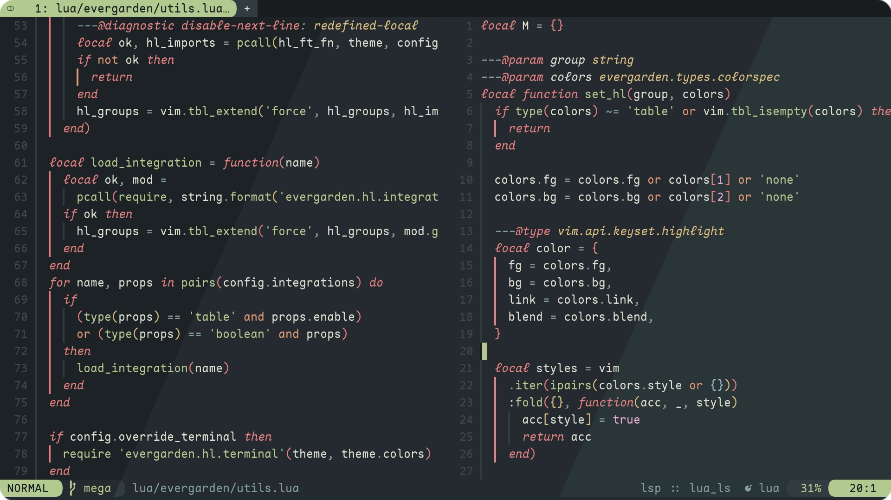
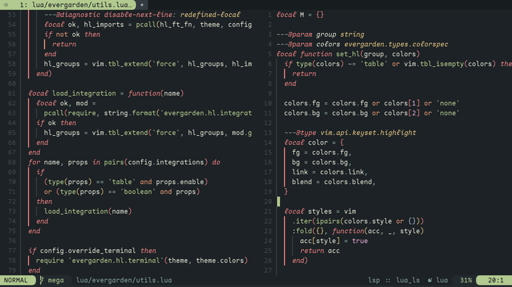
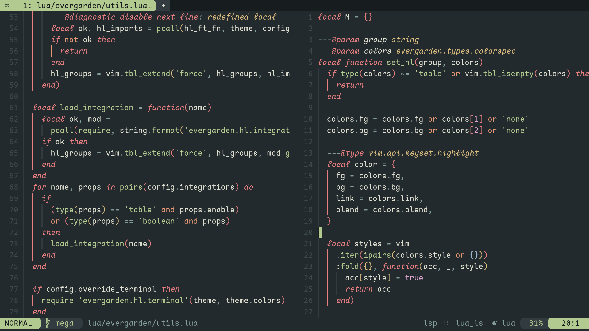
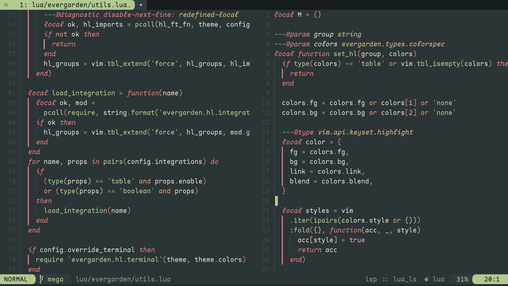
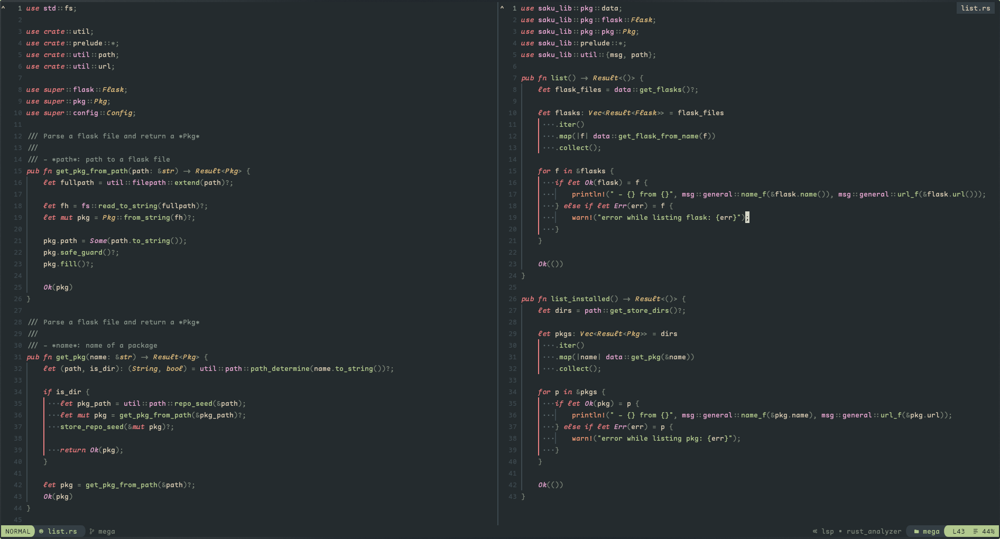
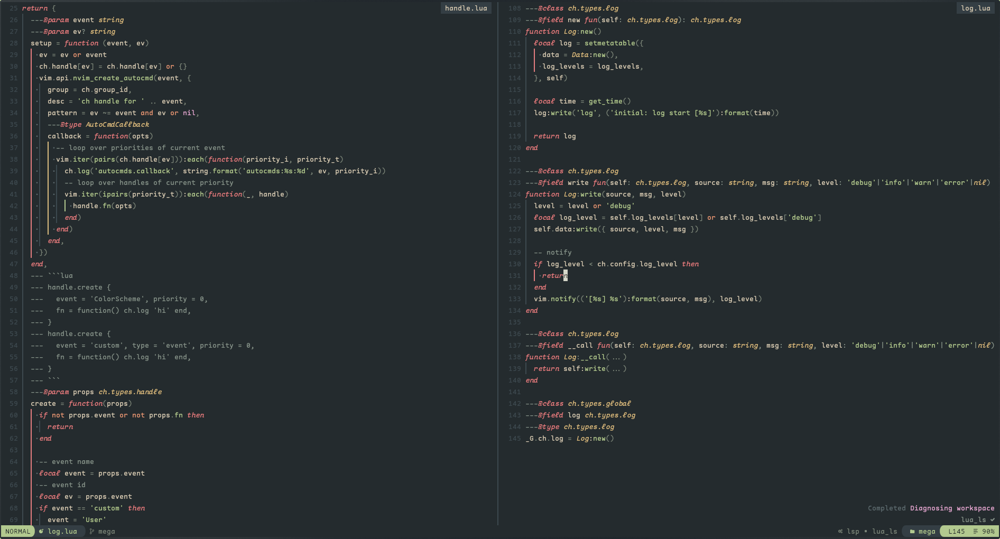

<h1 align="center">
    evergarden
</h1>

evergarden is a comfy neovim colorscheme for cozy morning coding.

evergarden is inspired by the [everforest colorscheme](https://github.com/sainnhe/everforest) and [nord colorscheme](https://github.com/nordtheme/nord).

evergarden was designed as a cozy theme with a focus on readability and visual comfort.

|        |                                                     |
| :----: | :-------------------------------------------------: |
| hard   |            |
| medium |        |
| soft   |            |

###### [more screenshots](#screenshots)

###### font in screenshots is [maple mono](https://github.com/subframe7536/maple-font)

## Installation

using [lazy.nvim](https://github.com/folke/lazy.nvim):

```lua
return {
  'comfysage/evergarden',
  priority = 1000, -- Colorscheme plugin is loaded first before any other plugins
  opts = {
    theme = {
      variant = 'fall', -- 'winter'|'fall'|'spring'
      accent = 'green',
    },
    editor = {
      transparent_background = false,
      sign = { color = 'none' },
      float = {
        color = 'mantle',
        invert_border = false,
      },
      completion = {
        color = 'surface0',
      },
    },
  }
}
```

using [vim-plug](https://github.com/junegunn/vim-plug):

```Vim
Plug 'comfysage/evergarden'
```

## Configuration

```lua
require 'evergarden'.setup {
  theme = {
    variant = 'fall', -- 'winter'|'fall'|'spring'
    accent = 'green',
  },
  editor = {
    transparent_background = false,
    override_terminal = true,
    sign = { color = 'none' },
    float = {
      color = 'mantle',
      invert_border = false,
    },
    completion = {
      color = 'surface0',
    },
  },
  style = {
    tabline = { 'reverse' },
    search = { 'italic', 'reverse' },
    incsearch = { 'italic', 'reverse' },
    types = { 'italic' },
    keyword = { 'italic' },
    comment = { 'italic' },
  },
  overrides = {},
  color_overrides = {},
}
```

### Integrations

```lua
{
  integrations = {
    blink_cmp = true,
    cmp = true,
    fzf_lua = true,
    gitsigns = true,
    indent_blankline = { enable = true, scope_color = 'green' },
    mini = {
      enable = true,
      animate = true,
      clue = true,
      completion = true,
      cursorword = true,
      deps = true,
      diff = true,
      files = true,
      hipatterns = true,
      icons = true,
      indentscope = true,
      jump = true,
      jump2d = true,
      map = true,
      notify = true,
      operators = true,
      pick = true,
      starters = true,
      statusline = true,
      surround = true,
      tabline = true,
      test = true,
      trailspace = true,
    },
    nvimtree = true,
    rainbow_delimiters = true,
    symbols_outline = true,
    telescope = true,
    which_key = true,
    neotree = true,
  },
}
```

### Overrides

Overrides can take all options passed to `vim.api.nvim_set_hl()`.

> [!note]
>
> - Ensure that `fg` (foreground color) and `bg` (background color) are correctly positioned as the first and second elements in the table, respectively. The `fg` and `bg` fields can also be refered to directly.
> - Confirm that `fg` and `bg` are strings, starting with a hash (`#`).

```lua
require 'evergarden'.setup {
  overrides = {
    Normal = {
      '#fddce3',
      '#1d2021',

      -- Additional highlight options can be included here
      style = { 'bold', 'italic' }
    },
    Keyword = {
      fg = '#ce96de',
      bg = '#ae45be',
    },
  },
}
```

## Screenshots





## Features

- Lots of style-customization options (background variants, color invertion, italics etc.)
- Support for Treesitter highlighting.
- Support for transparent background.
- Supported plugins: [blink_cmp][] [cmp][] [gitsigns][] [indent_blankline][] [nvimtree][] [rainbow_delimiters][] [symbols_outline][] [telescope][] [which_key][] [neotree][].

[blink_cmp]: https://github.com/Saghen/blink.cmp
[cmp]: https://github.com/hrsh7th/nvim-cmp
[gitsigns]: https://github.com/lewis6991/gitsigns.nvim
[indent_blankline]: https://github.com/lukas-reineke/indent-blankline.nvim
[nvimtree]: https://github.com/nvim-tree/nvim-tree.lua
[rainbow_delimiters]: https://github.com/hiphish/rainbow-delimiters.nvim
[symbols_outline]: https://github.com/simrat39/symbols-outline.nvim
[telescope]: https://github.com/nvim-telescope/telescope.nvim
[which_key]: https://github.com/folke/which-key.nvim
[neotree]: https://github.com/nvim-neo-tree/neo-tree.nvim


## :sparkles: Extras

- [alacritty](https://github.com/everviolet/ports/tree/main/ports/alacritty)
- [base16-scheme](https://github.com/everviolet/ports/tree/main/ports/base16)
- [iterm](https://github.com/everviolet/ports/tree/main/ports/iterm)
- [kitty theme](https://github.com/everviolet/ports/tree/main/ports/kitty)
- [scss](https://github.com/everviolet/ports/tree/main/ports/scss/evergarden.scss)
- [tmux](https://github.com/everviolet/ports/tree/main/ports/tmux)
- [discord theme](https://github.com/comfysage/evg-discord)
- [userstyles](https://github.com/comfysage/userstyles)

## License

[GPL-3.0](https://www.gnu.org/licenses/gpl-3.0.en.html)
