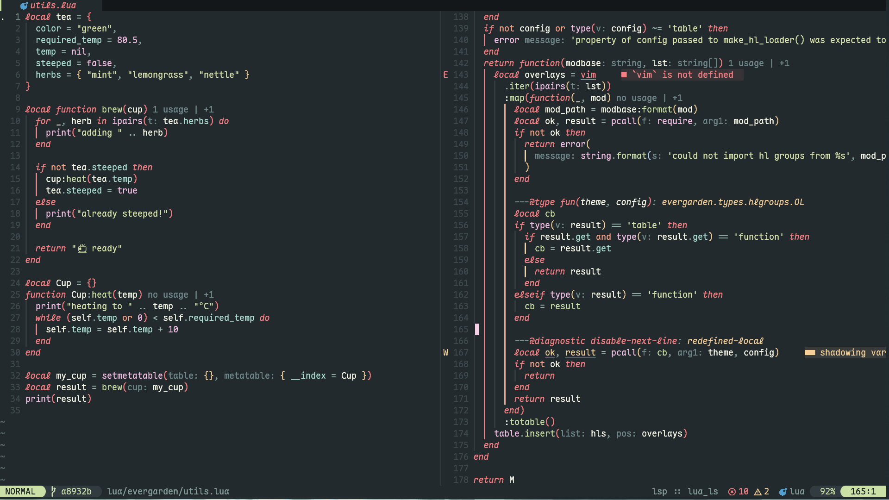
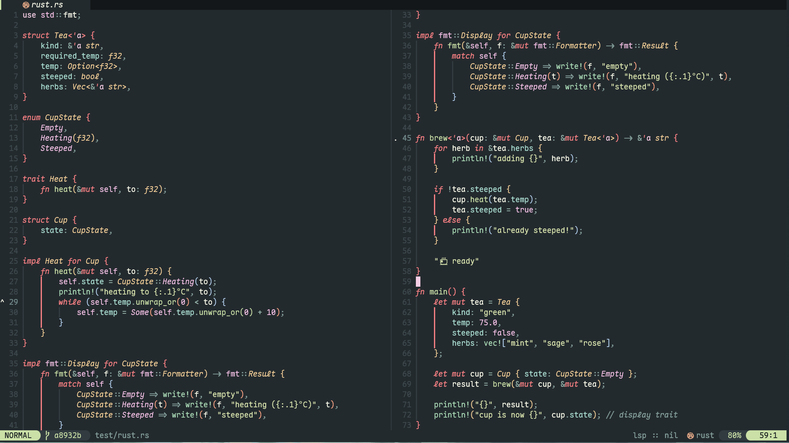

<h1 align="center">
    evergarden
</h1>

evergarden is a comfy neovim colorscheme for cozy morning coding.

evergarden is inspired by the [everforest colorscheme](https://github.com/sainnhe/everforest) and [nord colorscheme](https://github.com/nordtheme/nord).

evergarden was designed as a cozy theme with a focus on readability and visual comfort.

|        |                                                     |
| :----: | :-------------------------------------------------: |
|  hard  |  |
| medium |             |
|  soft  |  |

## Installation

using [lazy.nvim](https://github.com/folke/lazy.nvim):

```lua
return {
  'comfysage/evergarden',
  priority = 1000, -- Colorscheme plugin is loaded first before any other plugins
  opts = {
    transparent_background = true,
    variant = 'medium', -- 'hard'|'medium'|'soft'
    overrides = { }, -- add custom overrides
  }
}
```

using [vim-plug](https://github.com/junegunn/vim-plug):

```Vim
Plug 'comfysage/evergarden'
```

## Configuration

```lua
require 'evergarden'.setup {
  transparent_background = false,
  variant = 'medium', -- 'hard'|'medium'|'soft'
  override_terminal = true,
  style = {
    tabline = { 'reverse' },
    search = { 'italic' },
    incsearch = { 'reverse' },
    types = { 'italic' },
    keyword = { 'italic' },
    comment = { 'italic' },
    sign = { highlight = false },
  },
  integrations = {
    blink_cmp = true,
    cmp = true,
    gitsigns = true,
    indent_blankline = { enable = true, scope_color = 'green' },
    nvimtree = true,
    rainbow_delimiters = true,
    symbols_outline = true,
    telescope = true,
    which_key = true,
  },
  overrides = { }, -- add custom overrides
}
```

### Overrides

Overrides can take all options passed to `vim.api.nvim_set_hl()`.

> [!note]
>
> - Ensure that `fg` (foreground color) and `bg` (background color) are correctly positioned as the first and second elements in the table, respectively. The `fg` and `bg` fields can also be refered to directly.
> - Confirm that `fg` and `bg` are strings or arrays, with the first element representing the GUI color, and the second element representing the CTERM (Color Terminal) color, if specified.

```lua
require 'evergarden'.setup {
  overrides = {
    Normal = {
      '#fddce3',
      '#1d2021',

      -- Additional highlight options can be included here
      style = { 'bold', 'italic' }
    },
    Keyword = {
      fg = '#ce96de',
      bg = '#ae45be',
    },
  },
}
```

## Features

- Lots of style-customization options (background variants, color invertion, italics etc.)
- Support for Treesitter highlighting.
- Support for transparent background.
- Supported plugins: [blink_cmp][] [cmp][] [gitsigns][] [indent_blankline][] [nvimtree][] [rainbow_delimiters][] [symbols_outline][] [telescope][] [which_key][].

[blink_cmp]: Saghen/blink.cmp
[cmp]: hrsh7th/nvim-cmp
[gitsigns]: lewis6991/gitsigns.nvim
[indent_blankline]: lukas-reineke/indent-blankline.nvim
[nvimtree]: nvim-tree/nvim-tree.lua
[rainbow_delimiters]: hiphish/rainbow-delimiters.nvim
[symbols_outline]: simrat39/symbols-outline.nvim
[telescope]: nvim-telescope/telescope.nvim
[which_key]: folke/which-key.nvim


## :sparkles: Extras

- [alacritty](./extras/alacritty)
- [base16-scheme](./extras/base16)
- [kitty theme](./extras/kitty)
- [scss](./extras/scss/evergarden.scss)
- [tmux](./extras/tmux)
- [discord theme](https://github.com/comfysage/evg-discord)
- [userstyles](https://github.com/comfysage/userstyles)

## License

[GPL-3.0](https://www.gnu.org/licenses/gpl-3.0.en.html)
